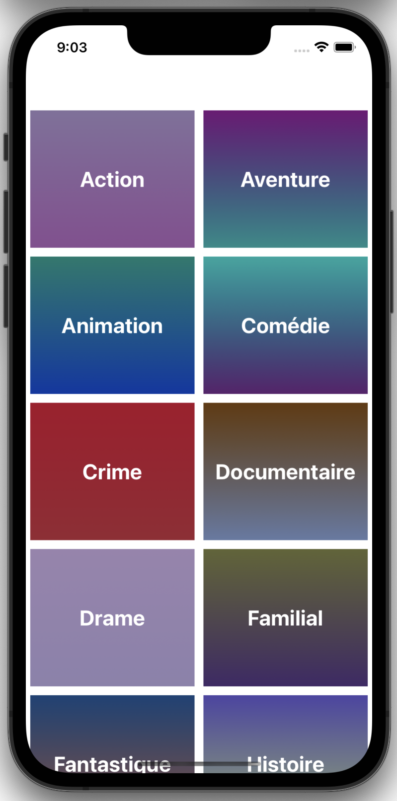
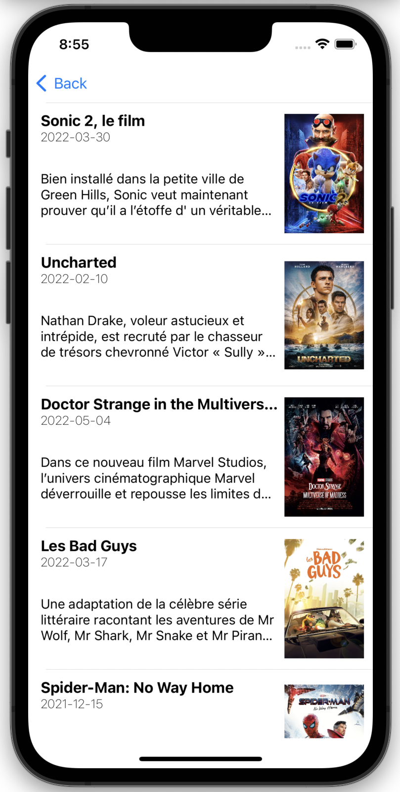
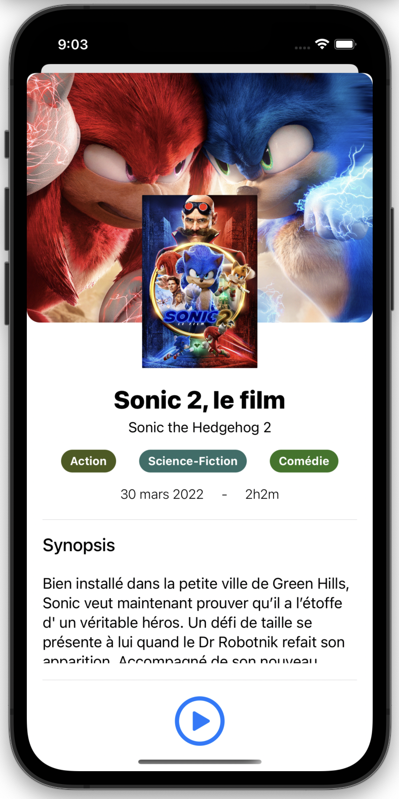

<div id="top"></div>

[![Contributors][contributors-shield]][contributors-url]
[![Forks][forks-shield]][forks-url]
[![Stargazers][stars-shield]][stars-url]
[![Issues][issues-shield]][issues-url]
[![MIT License][license-shield]][license-url]
[![LinkedIn][linkedin-shield]][linkedin-url]

<!-- PROJECT LOGO -->
<br />
<div align="center">
  <a href="https://github.com/PoulpY2K/movies-swift-ui">
<h3 align="center">TMDB Movies (Swift UI)</h3>
  </a>

  <p align="center">
    TMDB Movies est mon premier projet iOS que j'ai effectué durant ma Licence Professionnelle DIM, afin d'apprendre l'utilisation de Swift UI et UI Kit.
    <br />
    <a href="https://github.com/PoulpY2K/movies-swift-ui"><strong>Explorer la documentation »</strong></a>
    <br />
    <br />
    <a href="https://github.com/PoulpY2K/movies-swift-ui">Voir démo</a>
    ·
    <a href="https://github.com/PoulpY2K/movies-swift-ui/issues">Reporter des bugs</a>
    ·
    <a href="https://github.com/PoulpY2K/movies-swift-ui/issues">Demander une fonctionnalité</a>
  </p>
</div>

<!-- TABLE OF CONTENTS -->
<details>
  <summary>Sommaire</summary>
  <ol>
    <li>
      <a href="#à-propos-du-projet">À propos du projet</a>
      <ul>
        <li><a href="#construit-avec">Construit avec</a></li>
      </ul>
    </li>
    <li>
      <a href="#pour-commencer">Pour commencer</a>
      <ul>
        <li><a href="#prérequis">Prérequis</a></li>
        <li><a href="#installation">Installation</a></li>
      </ul>
    </li>
    <li><a href="#licence">Licence</a></li>
    <li><a href="#contact">Contact</a></li>
  </ol>
</details>

<!-- ABOUT THE PROJECT -->

## À propos du projet

<p align="center">
  
  
  
</p>

<p align="right">(<a href="#top">Revenir au début</a>)</p>

### Construit avec

- [SwiftUI](https://developer.apple.com/xcode/swiftui/)
- [UIKit](https://getuikit.com/)

<p align="right">(<a href="#top">Revenir au début</a>)</p>

<!-- GETTING STARTED -->

## Pour commencer

### Prérequis

- Il faut posséder un compte et une clef d'API sur [TheMovieDB](https://www.themoviedb.org/).

### Installation

1. Cloner le dépôt
   ```sh
   git clone https://github.com/PoulpY2K/movies-swift-ui.git
   ```

2. Ouvrir le projet avec XCode

3. Se rendre dans le fichier ```MoviesLive/Movies/Constants.swift``` et modifier le contenu de la constante ```apiKey```

4. Build et run l'application (sur Simulateur ou iPhone)

<p align="right">(<a href="#top">Revenir au début</a>)</p>

<!-- LICENSE -->

## Licence

Distribué sous la Licence MIT. Voir `LICENSE.md` pour plus d'informations.

<p align="right">(<a href="#top">Revenir au début</a>)</p>

<!-- CONTACT -->

## Contact

Jérémy Laurent - [@PoulpY2K](https://twitter.com/PoulpY2K) - contact@jeremy-laurent.com

Lien du projet: [https://github.com/PoulpY2K/movies-swift-ui](https://github.com/PoulpY2K/movies-swift-ui)

<p align="right">(<a href="#top">Revenir au début</a>)</p>

<!-- MARKDOWN LINKS & IMAGES -->
<!-- https://www.markdownguide.org/basic-syntax/#reference-style-links -->

[contributors-shield]: https://img.shields.io/github/contributors/PoulpY2K/movies-swift-ui.svg?style=for-the-badge
[contributors-url]: https://github.com/PoulpY2K/movies-swift-ui/graphs/contributors
[forks-shield]: https://img.shields.io/github/forks/PoulpY2K/movies-swift-ui.svg?style=for-the-badge
[forks-url]: https://github.com/PoulpY2K/movies-swift-ui/network/members
[stars-shield]: https://img.shields.io/github/stars/PoulpY2K/movies-swift-ui.svg?style=for-the-badge
[stars-url]: https://github.com/PoulpY2K/movies-swift-ui/stargazers
[issues-shield]: https://img.shields.io/github/issues/PoulpY2K/movies-swift-ui.svg?style=for-the-badge
[issues-url]: https://github.com/PoulpY2K/movies-swift-ui/issues
[license-shield]: https://img.shields.io/github/license/PoulpY2K/movies-swift-ui.svg?style=for-the-badge
[license-url]: https://github.com/PoulpY2K/movies-swift-ui/blob/main/LICENSE.txt
[linkedin-shield]: https://img.shields.io/badge/-LinkedIn-black.svg?style=for-the-badge&logo=linkedin&colorB=555
[linkedin-url]: https://www.linkedin.com/in/j%C3%A9r%C3%A9my-laurent-0986981b8/
[product-screenshot]: images/screenshot.png